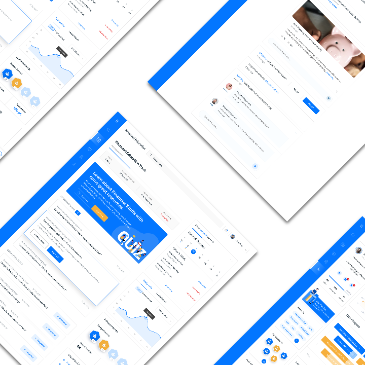

# Perspectiver

Add perspective to Images.

## [Live Site](https://perspective-image.netlify.com/)




## Why

Perspective designs are used in many many mock-ups, previews, and headers to give images a bit more visual interest. However, when I searched for a tool to easily transform my precomiled images into a different perspective, I found nothing that could do what I wanted with minimal friction... so I decided to make my own. 

## Svelte

This project is made with [Svelte](https://svelte.dev/), a compile to JavaScript framework for building
user interfaces. Svelte's compile to JavaScript process allows it to skip using the virtual DOM entirely.

## Installation

```bash
cd perspectiver
npm install
```

Developement with hot reload on localhost:5000
```bash
npm run dev
```

Build
```bash
npm run build
```